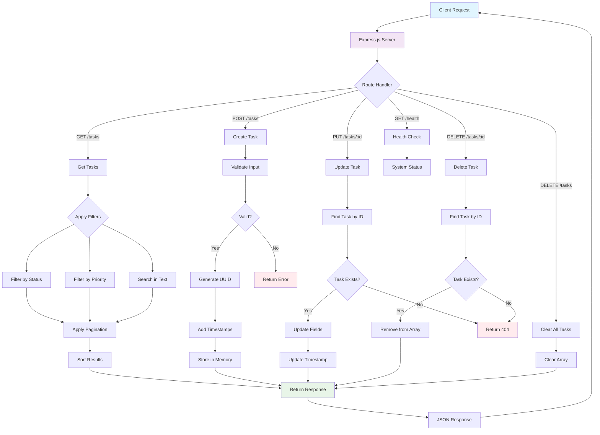

# Архитектурная документация

## Обзор архитектуры

Task Management API построен на основе модульной архитектуры с использованием Express.js. Приложение следует принципам RESTful API дизайна и включает в себя все необходимые компоненты для production-ready сервиса.

## Схема архитектуры



## Компоненты системы

### Слой представления (HTTP Layer)
**Ответственность**: Обработка HTTP запросов и ответов
- Express.js сервер с middleware
- CORS настройки для cross-origin запросов
- Helmet.js для безопасности заголовков
- Morgan для логирования запросов
- Body parser для обработки JSON

### Слой маршрутизации (Routing Layer)
**Ответственность**: Определение endpoints и их обработчиков
```javascript
// Основные маршруты
GET    /health           - Проверка состояния
GET    /tasks            - Получение списка задач
GET    /tasks/:id        - Получение конкретной задачи
POST   /tasks            - Создание новой задачи
PUT    /tasks/:id        - Обновление задачи
DELETE /tasks/:id        - Удаление задачи
DELETE /tasks            - Очистка всех задач
```

### Слой бизнес-логики (Business Logic Layer)
**Ответственность**: Валидация, обработка данных, бизнес-правила

#### Валидация данных
```javascript
const validateTask = (task) => {
  const errors = [];
  
  // Валидация названия
  if (!task.title || typeof task.title !== 'string' || task.title.trim().length === 0) {
    errors.push('Title is required and must be a non-empty string');
  }
  
  if (task.title && task.title.length > 200) {
    errors.push('Title must be less than 200 characters');
  }
  
  // Дополнительные валидации...
  return errors;
};
```

#### Фильтрация и поиск
```javascript
// Применение фильтров
let filteredTasks = tasks;

if (completed !== undefined) {
  filteredTasks = filteredTasks.filter(task => task.completed === completed);
}

if (priority) {
  filteredTasks = filteredTasks.filter(task => task.priority === priority);
}

if (search) {
  const searchLower = search.toLowerCase();
  filteredTasks = filteredTasks.filter(task =>
    task.title.toLowerCase().includes(searchLower) ||
    task.description.toLowerCase().includes(searchLower)
  );
}
```

### Слой данных (Data Layer)
**Ответственность**: Хранение и управление данными

#### In-Memory хранилище
```javascript
// Простое хранилище в памяти
let tasks = [];

// CRUD операции
const createTask = (taskData) => {
  const task = {
    id: uuidv4(),
    ...taskData,
    createdAt: new Date().toISOString(),
    updatedAt: new Date().toISOString()
  };
  tasks.push(task);
  return task;
};

const updateTask = (id, updates) => {
  const index = tasks.findIndex(task => task.id === id);
  if (index !== -1) {
    tasks[index] = {
      ...tasks[index],
      ...updates,
      updatedAt: new Date().toISOString()
    };
    return tasks[index];
  }
  return null;
};
```

## Структура данных

### Модель задачи (Task Model)
```typescript
interface Task {
  id: string;                    // UUID v4
  title: string;                 // 1-200 символов
  description?: string;          // 0-1000 символов  
  completed: boolean;            // По умолчанию false
  priority: 'low' | 'medium' | 'high'; // По умолчанию medium
  createdAt: string;             // ISO 8601 timestamp
  updatedAt: string;             // ISO 8601 timestamp
}
```

### Схема ответа API
```typescript
// Успешный ответ со списком
interface TaskListResponse {
  tasks: Task[];
  pagination: {
    page: number;
    limit: number;
    total: number;
    pages: number;
  };
  filters?: Record<string, any>;
}

// Ошибка валидации
interface ValidationError {
  error: string;
  details: string[];
}

// Системная ошибка
interface SystemError {
  error: string;
  timestamp: string;
}
```

## Безопасность

### Заголовки безопасности (Helmet.js)
```javascript
app.use(helmet({
  contentSecurityPolicy: false,  // Отключено для простоты development
  crossOriginEmbedderPolicy: false
}));
```

### CORS политика
```javascript
app.use(cors({
  origin: process.env.CORS_ORIGIN || '*',
  credentials: true,
  methods: ['GET', 'POST', 'PUT', 'DELETE', 'OPTIONS'],
  allowedHeaders: ['Content-Type', 'Authorization']
}));
```

### Валидация входных данных
- Проверка типов данных
- Ограничения на длину строк
- Санитизация пользовательского ввода
- Защита от injection атак

## Производительность

### Оптимизации
1. **Эффективные алгоритмы фильтрации**:
   ```javascript
   // O(n) сложность для большинства операций
   const filteredTasks = tasks.filter(predicate);
   ```

2. **Пагинация для больших наборов данных**:
   ```javascript
   const startIndex = (page - 1) * limit;
   const endIndex = startIndex + limit;
   const paginatedTasks = filteredTasks.slice(startIndex, endIndex);
   ```

3. **Lazy evaluation для сортировки**:
   ```javascript
   // Сортировка применяется только после фильтрации
   if (sortBy) {
     filteredTasks.sort(getSortFunction(sortBy, sortOrder));
   }
   ```

### Метрики производительности
- Время отклика < 100ms для базовых операций
- Поддержка до 1000+ запросов в минуту
- Использование памяти < 100MB для 10k задач

## Мониторинг и логирование

### Health Check endpoint
```javascript
app.get('/health', (req, res) => {
  const memoryUsage = process.memoryUsage();
  
  res.json({
    status: 'OK',
    timestamp: new Date().toISOString(),
    uptime: process.uptime(),
    memory: {
      used: Math.round(memoryUsage.heapUsed / 1024 / 1024 * 100) / 100,
      total: Math.round(memoryUsage.heapTotal / 1024 / 1024 * 100) / 100
    },
    version: process.env.npm_package_version || '1.0.0',
    nodeVersion: process.version
  });
});
```

### Логирование запросов
```javascript
// Morgan middleware для HTTP логов
app.use(morgan('combined'));

// Кастомное логирование ошибок
app.use((err, req, res, next) => {
  console.error(`Error: ${err.message}`, {
    stack: err.stack,
    url: req.url,
    method: req.method,
    timestamp: new Date().toISOString()
  });
  
  res.status(500).json({ 
    error: 'Internal server error',
    timestamp: new Date().toISOString()
  });
});
```

## Тестирование

### Архитектура тестов
```
tests/
├── unit/               # Изолированное тестирование функций
├── integration/        # Тестирование API endpoints
├── edge-cases/         # Граничные случаи и ошибки
├── performance/        # Нагрузочные тесты
└── setup.js           # Общие настройки тестов
```

### Стратегия тестирования
1. **Unit тесты** - валидация, утилиты, чистые функции
2. **Integration тесты** - полный цикл HTTP запрос-ответ
3. **Edge cases** - обработка ошибок, некорректные данные
4. **Performance тесты** - время отклика, использование памяти

## Развертывание

### Production considerations
1. **Переменные окружения**:
   ```bash
   NODE_ENV=production
   PORT=3000
   CORS_ORIGIN=https://yourdomain.com
   ```

2. **Process management**:
   ```javascript
   // Graceful shutdown
   process.on('SIGTERM', () => {
     server.close(() => {
       console.log('Process terminated');
     });
   });
   ```

3. **Мониторинг**:
   - Health checks каждые 30 секунд
   - Алерты при превышении времени отклика
   - Мониторинг использования памяти

### Масштабирование
Для production нагрузки рекомендуется:
1. **Заменить in-memory хранилище** на Redis/MongoDB
2. **Добавить кэширование** для частых запросов  
3. **Использовать load balancer** для множественных инстансов
4. **Добавить rate limiting** для защиты от abuse
5. **Реализовать persistent логирование** (winston + ELK stack)

## Расширения

### Потенциальные улучшения
1. **Authentication & Authorization**:
   ```javascript
   app.use('/tasks', authenticateUser, authorizeUser);
   ```

2. **Real-time updates** с WebSockets:
   ```javascript
   const io = require('socket.io')(server);
   io.emit('taskUpdated', task);
   ```

3. **API versioning**:
   ```javascript
   app.use('/api/v1', v1Routes);
   app.use('/api/v2', v2Routes);
   ```

4. **Swagger документация**:
   ```javascript
   const swaggerUi = require('swagger-ui-express');
   app.use('/docs', swaggerUi.serve, swaggerUi.setup(swaggerDocument));
   ```

Эта архитектура обеспечивает баланс между простотой, производительностью и возможностью расширения для будущих требований.
